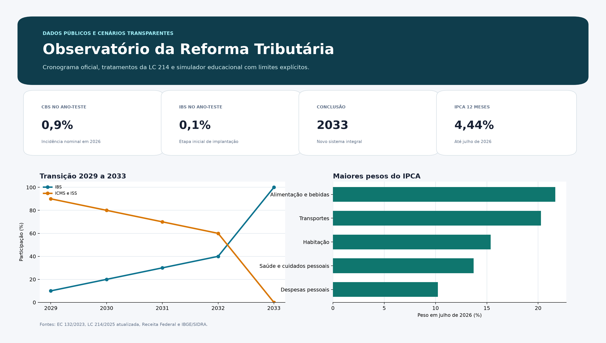
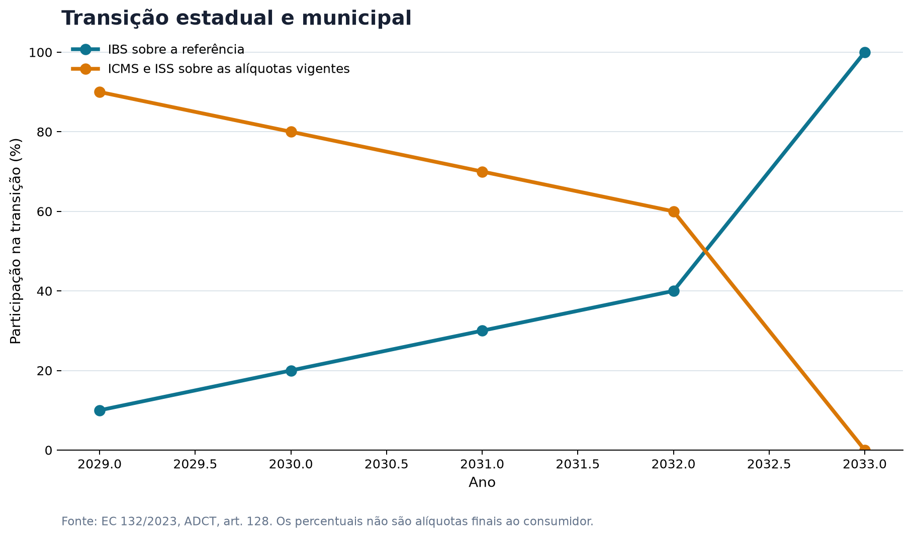
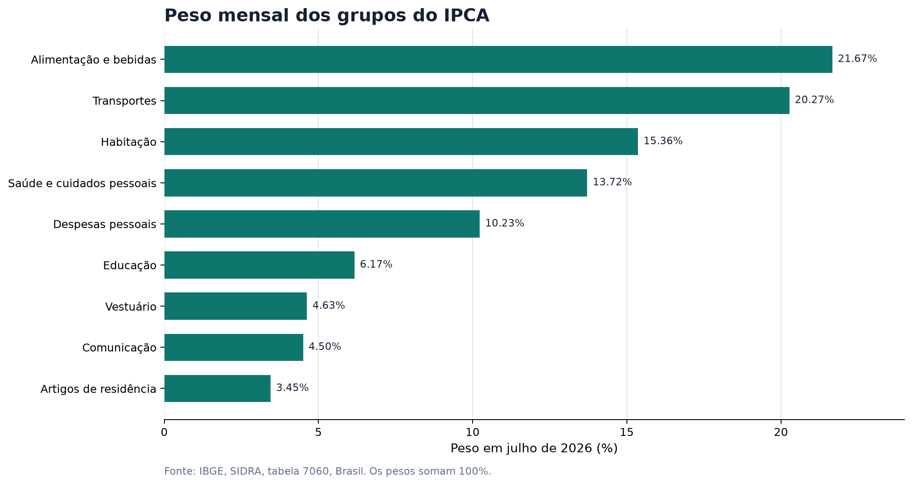

# Observatório da Reforma Tributária do Consumo


Aplicação interativa para traduzir a Reforma Tributária do Consumo em uma
experiência clara, rastreável e útil. O painel combina legislação oficial,
dados reais do IBGE e simulações ajustáveis sem apresentar hipótese como
resultado definitivo.



## O problema

A reforma envolve siglas, etapas, anexos e tratamentos diferentes. Uma leitura
apressada costuma produzir três erros:

- interpretar os 0,9% de CBS e 0,1% de IBS de 2026 como alíquota final;
- aplicar uma única regra a setores muito amplos, como todo o grupo Alimentação;
- calcular aumento ou redução de preços sem conhecer créditos, classificação,
  regime, cadeia produtiva e comportamento das empresas.

Este projeto foi desenhado para impedir esses atalhos. Cada tela deixa claro o
que é fato oficial, o que é cenário e qual é o limite da conclusão.

## Perguntas que o painel responde

1. O que acontece em cada ano entre 2026 e 2033?
2. Qual é a diferença entre CBS, IBS e Imposto Seletivo?
3. Quais categorias possuem alíquota zero ou redução de 30% ou 60%?
4. Qual artigo e anexo sustentam cada tratamento exibido?
5. Como uma alíquota hipotética reage a cada redução legal?
6. Qual é a composição dos nove grupos do IPCA em julho de 2026?
7. Como tratamentos diferentes alteram nominalmente uma cesta familiar
   hipotética?

## O que torna a análise confiável

| Camada | Origem | Uso no projeto |
|---|---|---|
| Cronograma | EC 132/2023 e Receita Federal | Transição de 2026 a 2033 |
| Tratamentos | LC 214/2025, texto atualizado | Reduções, alíquota zero, artigos e anexos |
| Composição do consumo | IBGE, SIDRA, tabela 7060 | Pesos mensais dos nove grupos do IPCA |
| Inflação | IBGE, IPCA e INPC de julho de 2026 | Variação mensal, no ano e em 12 meses |
| Simulações | Valores escolhidos pelo usuário | Sensibilidade nominal, nunca previsão |

Os pesos mensais foram consultados diretamente no SIDRA em 13 de agosto de
2026. O arquivo original e o código de atualização permanecem no repositório.

## Funcionalidades

### Visão geral

- indicadores centrais do ano-teste;
- explicação direta de CBS, IBS, Imposto Seletivo, destino e não cumulatividade;
- contexto do IPCA mais recente disponível.

### Transição 2026 a 2033

- seletor de ano com leitura simples da etapa;
- gráfico da substituição gradual de ICMS e ISS pelo IBS;
- calculadora nominal de CBS e IBS no ano-teste de 2026.

### Tratamentos legais

- filtro por setor e tipo de tratamento;
- catálogo com artigo, anexo e limite de enquadramento;
- calculadora de alíquota efetiva para uma categoria selecionada.

### Cesta familiar

- pesos reais dos nove grupos do IPCA Brasil;
- explicação do motivo pelo qual grupo do IPCA não equivale a categoria legal;
- cesta editável por categoria da LC 214;
- comparação entre alíquota cheia e tratamento reduzido.

### Dados e método

- fórmulas exibidas no próprio aplicativo;
- lista do que o painel não calcula;
- links para fontes primárias;
- download das bases em CSV.

## Principais achados

- **2026 é um ano-teste.** A incidência nominal de 1% é dividida entre CBS
  e IBS, com regras de compensação e dispensa condicionada.
- **A transição estadual e municipal ganha escala a partir de 2029.** O IBS
  passa de 10% para 40% da referência até 2032 e entra integralmente em 2033.
- **Alimentação não tem um único tratamento.** A cesta básica pode ter
  alíquota zero, outros alimentos podem receber redução de 60% e a classificação
  precisa ser conferida nos anexos.
- **Os dois maiores pesos do IPCA em julho de 2026 são Alimentação e bebidas
  e Transportes.** Isso descreve o índice de preços, não a futura carga desses
  grupos.





## Como as simulações funcionam

O painel usa apenas contas nominais e fáceis de auditar:

```text
alíquota efetiva = alíquota-padrão × (1 - redução / 100)

tributo nominal = base sem IBS/CBS × alíquota efetiva / 100

diferença nominal = tributo sem redução - tributo com tratamento
```

Exemplo: uma alíquota hipotética de 28% com redução legal de 60% resulta em
11,2% no cenário. Isso não significa que 28% seja uma taxa final oficial e não
prevê o preço que chegará ao consumidor.

## Estrutura do projeto

```text
reforma-tributaria-2026/
├── app.py
├── assets/
│   ├── preview.png
│   ├── pesos_ipca_julho_2026.png
│   ├── tratamentos_legais.png
│   └── transicao_2029_2033.png
├── data/
│   ├── cesta_familiar_exemplo.csv
│   ├── cronograma_transicao.csv
│   ├── indicadores_ipca_2026_07.csv
│   ├── ipca_grupos_2026_07.csv
│   └── tratamentos_legais.csv
├── docs/
│   ├── como_explicar_o_projeto.md
│   ├── fontes_e_metodo.md
│   └── linkedin.md
├── notebooks/
│   └── analise_reforma_tributaria.ipynb
├── scripts/
│   ├── atualizar_ipca.py
│   └── gerar_visualizacoes.py
├── src/
│   ├── calculos.py
│   └── dados.py
└── tests/
```

## Como executar com Python 3.14

No macOS ou Linux:

```bash
git clone https://github.com/bruno-dsn/reforma-tributaria-2026.git
cd reforma-tributaria-2026

python3.14 -m venv .venv
source .venv/bin/activate

python -m pip install --upgrade pip
python -m pip install -r requirements.txt
streamlit run app.py
```

No Windows, ative o ambiente com:

```powershell
.venv\Scripts\activate
```

## Testes

```bash
python -m pip install -r requirements-dev.txt
python -m pytest -q
```

Os testes cobrem as fórmulas, validações, integridade do cronograma, soma dos
pesos do IPCA, rastreabilidade dos tratamentos e inicialização do aplicativo.

## Atualizar os pesos do IPCA

O script consulta a API oficial do SIDRA. Informe o mês no formato `AAAAMM`:

```bash
python scripts/atualizar_ipca.py 202607
```

Uma atualização de mês exige também revisar o texto do painel e o relatório
mensal do IBGE antes de publicar os novos indicadores.

## Limitações assumidas

O projeto não calcula preço final, carga atual por produto, créditos ao longo da
cadeia, cashback, regimes específicos ou enquadramento definitivo de NCM e NBS.
Também não informa uma alíquota-padrão futura oficial.

Essa decisão é parte do método. Em tema regulatório, reconhecer o limite do dado
é melhor do que produzir precisão aparente.

## Fontes primárias

- [Emenda Constitucional 132/2023](https://www.planalto.gov.br/ccivil_03/constituicao/emendas/emc/emc132.htm)
- [Lei Complementar 214/2025, texto atualizado](https://www2.camara.leg.br/legin/fed/leicom/2025/leicomplementar-214-16-janeiro-2025-796905-normaatualizada-pl.html)
- [Lei Complementar 227/2026](https://www.planalto.gov.br/ccivil_03/leis/lcp/lcp227.htm)
- [Receita Federal, entenda a reforma](https://www.gov.br/receitafederal/pt-br/acesso-a-informacao/acoes-e-programas/programas-e-atividades/reforma-tributaria-do-consumo/entenda)
- [IBGE, tabela SIDRA 7060](https://sidra.ibge.gov.br/tabela/7060)
- [IBGE, IPCA e INPC de julho de 2026](https://biblioteca.ibge.gov.br/visualizacao/periodicos/236/inpc_ipca_2026_jul.pdf)

## Autor

**Bruno Nunes**
Cientista de Dados em formação na FIAP, com foco em Python, análise de dados,
machine learning e construção de produtos orientados a dados.

[GitHub](https://github.com/bruno-dsn) | [LinkedIn](https://www.linkedin.com/in/bruno-dsn/)

## Licença

Distribuído sob a licença MIT. Consulte [LICENSE](LICENSE).
